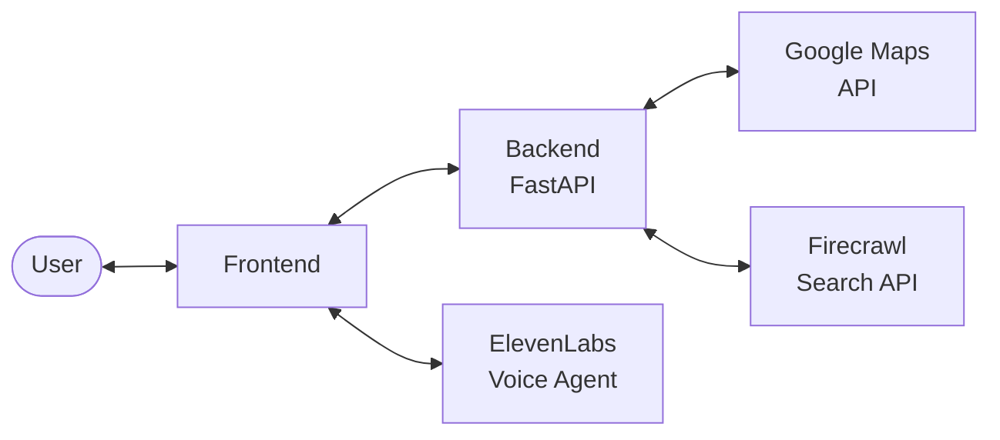

# CareNav

Voice-powered AI hospital navigator that helps you find the right hospital for your medical situation through natural conversation, real-time web search, and geolocation.

Powered by [ElevenLabs](https://elevenlabs.io) · [Firecrawl](https://firecrawl.dev) · [Google Maps](https://console.cloud.google.com)

## Demo

[](https://www.youtube.com/watch?v=KhK5NaJHR4E)

> 🔥 **[Try CareNav 🌐](https://carenav.onrender.com/)**

## How It Works

1. **Locate** — Detects your location via GPS or manual address entry
2. **Discover** — Finds the 5 nearest hospitals within 10 km using Google Places
3. **Triage** — A voice AI agent asks about your symptoms, severity, and insurance
4. **Research** — Runs a two-layer web search powered by Firecrawl:
   - **Layer 1 (Triage-Informed)**: After triage, runs up to 3 concurrent searches per hospital — symptom/specialty match, insurance compatibility, and patient reviews — across all 5 hospitals simultaneously (up to 15 queries in parallel).
   - **Layer 2 (Agent-Driven Refinement)**: After 1–2 follow-up questions informed by L1 results, the voice agent constructs a single targeted query combining specific hospital names, conditions, and user preferences to gather the final details needed for a recommendation.
5. **Recommend** — Highlights the best-fit hospital and provides a direct phone link to call

## Architecture



## Tech Stack

| Layer | Technology |
|-------|-----------|
| Frontend | HTML / CSS / JavaScript |
| Backend | Python 3.12+, FastAPI |
| Voice AI | ElevenLabs Conversational AI |
| Hospital Discovery | Google Maps / Places API |
| Web Intelligence | Firecrawl Search API |
| Geocoding | Nominatim (OpenStreetMap) |

## Project Structure

```
├── frontend/
│   ├── index.html          # Main page
│   ├── app.js              # Client-side logic
│   ├── styles.css          # Glassmorphism design system
│   └── logo.png
├── backend/
│   ├── main.py             # FastAPI endpoints
│   ├── elevenlabs_agent.py # One-time script to create the ElevenLabs voice agent
│   ├── firecrawl_utils.py  # L1/L2 search logic
│   └── map_utils.py        # Google Places utilities
├── .env.template           # Required API keys
└── pyproject.toml
```

## Getting Started

### Prerequisites

- [uv](https://docs.astral.sh/uv/) (Python package manager)
- API keys for: [ElevenLabs](https://elevenlabs.io), [Firecrawl](https://firecrawl.dev), [Google Maps](https://console.cloud.google.com)

### Setup

```bash
# Install dependencies
uv sync

# Configure environment
cp .env.template .env
# Fill in your API keys in .env

# Create the ElevenLabs voice agent (one-time)
uv run python backend/elevenlabs_agent.py
# Copy the printed ELEVENLABS_AGENT_ID into your .env

# Run the server
uv run uvicorn backend.main:app --reload --host 0.0.0.0 --port 8000
```

Open [http://localhost:8000](http://localhost:8000), allow geolocation (or enter an address), and click the microphone to start.

## API Endpoints

| Method | Path | Description |
|--------|------|-------------|
| GET | `/api/hospitals/enriched` | Fetch nearest hospitals |
| GET | `/api/maps-key` | Google Maps API key for frontend |
| GET | `/api/signed-url` | Signed WebSocket URL for voice session |
| POST | `/api/hospitals/search-l1` | Layer 1: triage-informed search |
| POST | `/api/hospitals/search-l2` | Layer 2: agent-driven refined search |

